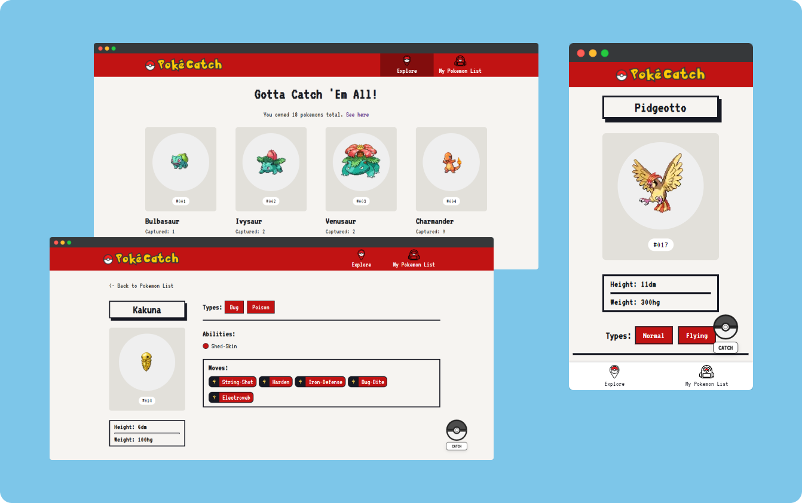

<h1 style="text-align: center;">PokeCatch</h1>
<h6 style="text-align: center;">Explore PokeCatch, and catch your pokemon here!</h6>



## How to run

First, copy the project to your machine

```
git clone https://github.com/faiq-naufal/pokecatch.git
```

And then run the development server:

```
npm run dev
or
yarn dev
```

Open [http://localhost:3000](http://localhost:3000) with your browser to see the result.

## Technologies Used

- [React.js](https://reactjs.org)

- [Next.js](https://nextjs.org)

- [CSS-in-JS Emotion](https://emotion.sh)

- [Apollo Client](https://www.apollographql.com/docs/react)

- [Local Storage](https://developer.mozilla.org/en-US/docs/Web/API/Window/localStorage)

- [Vercel Hosting](https://vercel.com)

## Data Source

- [graphql-pokeapi](https://github.com/mazipan/graphql-pokeapi)
